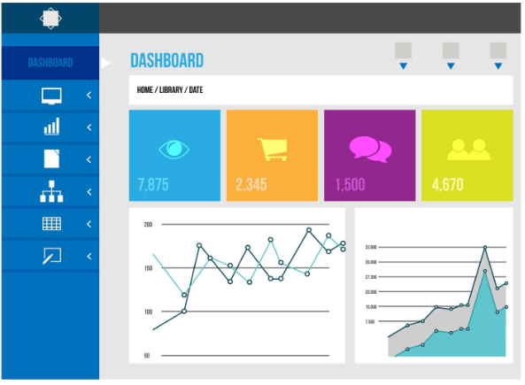

# Sistema de Ventas e Inventario

Sistema web de **ventas (POS)**, **inventario** y **facturación electrónica ante SUNAT**
para un negocio, construido con **Laravel 11 + MySQL** y CSS propio. Incluye login,
dashboard con métricas y gráficos, y un menú vertical con todos los módulos.



---

## Requisitos

- PHP **8.2** o superior, con las extensiones `pdo_mysql`, `mbstring`, `openssl`,
  `fileinfo`, `ctype`, `json`, `bcmath`, `curl` y **`soap`**.
  > `soap` es obligatoria para la facturación electrónica: Greenter se comunica
  > con SUNAT por SOAP. Sin ella el sistema funciona, pero no emite comprobantes.
- [Composer](https://getcomposer.org/)
- MySQL 5.7+ / MariaDB 10.3+
- (Recomendado en Windows) **XAMPP**, **Laragon** o **WAMP**

---

## Instalación paso a paso

### 1. Instalar las dependencias

```bash
composer install
```

### 2. Crear el archivo de entorno y la clave de la app

```bash
copy .env.example .env      # En Mac/Linux: cp .env.example .env
php artisan key:generate
```

> **Importante:** una vez guardadas las credenciales de SUNAT, **no regeneres la
> `APP_KEY`**: la clave SOL y la del certificado se guardan cifradas con ella.
> Respáldala.

### 3. Crear la base de datos

```sql
CREATE DATABASE saas_ventas_inventario
  CHARACTER SET utf8mb4 COLLATE utf8mb4_unicode_ci;
```

Y ajusta las credenciales en el `.env`:

```
DB_CONNECTION=mysql
DB_HOST=127.0.0.1
DB_PORT=3306
DB_DATABASE=saas_ventas_inventario
DB_USERNAME=root
DB_PASSWORD=
```

### 4. Ejecutar migraciones y datos de ejemplo

```bash
php artisan migrate --seed
```

Esto crea la empresa, los usuarios y el **catálogo del rubro**: aceites por
grado, filtros, grasas, refrigerantes, pernos por medida, tuercas, arandelas y
abrazaderas, con sus unidades reales (galón, litro, kilo, ciento, metro) y un
historial de compras y ventas coherente para que el dashboard, el kardex y los
reportes tengan datos.

Para recargar solo el catálogo, sin volver a migrar:

```bash
php artisan db:seed --class=CatalogoLubricantesPernosSeeder
```

> Ese comando **borra** productos, compras, ventas y movimientos existentes
> antes de recargar. No toca clientes, usuarios ni la configuración.

### 5. Enlazar el almacenamiento (imágenes de productos)

```bash
php artisan storage:link
```

### 6. Levantar el servidor

```bash
php artisan serve
```

Abre <http://localhost:8000>.

---

## Credenciales de acceso (datos demo)

| Rol | Correo | Contraseña |
|---|---|---|
| Administrador | `admin@saas.test` | `password` |
| Vendedor | `vendedor@saas.test` | `password` |

> El sistema **no tiene registro público**: atiende a una sola empresa y los
> usuarios los crea el administrador desde *Usuarios*.

---

## Módulos

- **Punto de Venta (POS)**: buscador de productos en vivo, carrito, cliente,
  comprobante, método de pago y descuento. Calcula el IGV solo sobre lo gravado.
  Al cobrar registra la venta, descuenta stock y genera el movimiento de
  inventario dentro de una transacción, y emite el comprobante electrónico.
- **Ventas**: historial con filtros por fecha, estado y número; ver/imprimir
  ticket y **anular** (repone stock y genera la anulación ante SUNAT).
- **Cotizaciones**: *Punto de Cotización* con la misma mecánica del POS para
  armar una propuesta de precio. Una cotización **no mueve inventario**: se
  congelan precio, unidad y afectación al IGV, se le pone fecha de validez y
  se imprime para el cliente. Al **convertirla en venta** se valida el stock
  con bloqueo, se descuenta, se registra el movimiento y se emite el
  comprobante. No se puede convertir dos veces, ni una vencida o rechazada.
  Se imprime en **A4** (para PDF o correo) o en **ticket de 80 mm** para la
  ticketera del mostrador.
- **Comprobantes electrónicos**: bandeja con estados SUNAT, descarga de XML y
  CDR, reenvío de pendientes, envío por correo y resumen diario de boletas.
  Ver [FACTURACION_ELECTRONICA.md](FACTURACION_ELECTRONICA.md).
- **Compras**: registro a proveedor con líneas dinámicas; incrementa stock,
  actualiza el costo y registra el movimiento. Historial, detalle y anulación.
- **Productos, Categorías y Marcas**: CRUD con búsqueda, filtro por categoría y
  por stock bajo, imagen, stock mínimo, **unidad de medida** y **afectación al
  IGV** (gravado / exonerado / inafecto), y protección contra borrado si están
  en uso.
- **Kardex y Ajustes de stock**: historial de entradas, salidas y ajustes con
  stock antes/después. Ajustes por conteo físico, merma, robo, devolución o
  corrección.
- **Clientes y Proveedores**: CRUD completo con validación de documento y
  protección contra borrado si tienen ventas/compras asociadas.
- **Reportes**: Ventas (total, ticket promedio, IGV, top productos), Inventario
  (valorización, stock bajo) y Ganancias (utilidad y margen). Con filtro de
  fechas y exportación a CSV compatible con Excel.
- **Usuarios y roles**: Administrador / Gerente / Vendedor, con middleware que
  restringe los módulos por rol. No puedes eliminar tu propia cuenta ni quitarte
  el rol de admin.
- **Configuración de empresa** (solo admin): nombre, RUC, dirección, teléfono,
  correo, moneda, **% de IGV** y logo. Se aplican en el sidebar, el login, el
  POS, el ticket y los comprobantes.

---

## Nota sobre `empresa_id`

Las tablas de negocio llevan una columna `empresa_id` y los modelos aplican un
filtro automático por ella (`BelongsToEmpresa` + `Tenant`). La aplicación
atiende a **una sola empresa**, así que ese filtro no separa clientes: queda
como salvaguarda para que ninguna consulta pueda devolver datos ajenos si en el
futuro se reintroduce el multiempresa.

La tabla `empresas` contiene **una sola fila** con los datos del negocio.

---

## Tareas programadas

La facturación electrónica necesita el scheduler activo para reintentar envíos,
declarar el resumen diario de boletas y consultar los tickets de SUNAT:

```
* * * * * cd /ruta/proyecto && php artisan schedule:run >> /dev/null 2>&1
```

---

## Estructura del proyecto

```
app/
 ├─ Console/Commands/      facturacion:instalar, :emitir-prueba, :reintentar,
 │                         :resumen-boletas, :consultar-tickets
 ├─ Http/Controllers/      Auth/Login, Dashboard, Venta, Compra, Producto,
 │                         Categoria, Marca, Cliente, Proveedor, Inventario,
 │                         Reporte, Usuario, Empresa, Facturacion
 ├─ Http/Middleware/       EnsureAdmin, IdentifyTenant
 ├─ Models/                User, Empresa, Producto, Categoria, Marca, Cliente,
 │                         Proveedor, Venta, VentaDetalle, Compra,
 │                         CompraDetalle, MovimientoInventario,
 │                         FacturacionConfig, FacturacionResumen
 └─ Services/Facturacion/  Manager, contrato, DTO y drivers (Greenter, Null)
database/
 ├─ migrations/            Todas las tablas del sistema
 └─ seeders/               DatabaseSeeder, CatalogoLubricantesPernosSeeder
resources/views/           layouts, auth, dashboard y un directorio por módulo
storage/app/facturacion/   Certificado, XML firmados, CDR y PDF (respaldo fiscal)
public/css/app.css         Estilos
routes/web.php             Rutas del sistema
routes/console.php         Tareas programadas
```

---

## Próximos pasos sugeridos

1. **ICBPER** (impuesto a las bolsas plásticas) en el comprobante.
2. **Alertas**: certificado por vencer y comprobantes que se acercan al plazo de
   envío a SUNAT.
3. Que la **anulación local** no se adelante a la respuesta de SUNAT.
4. Sacar `.env` y los volcados `.sql` fuera de la carpeta del proyecto.
